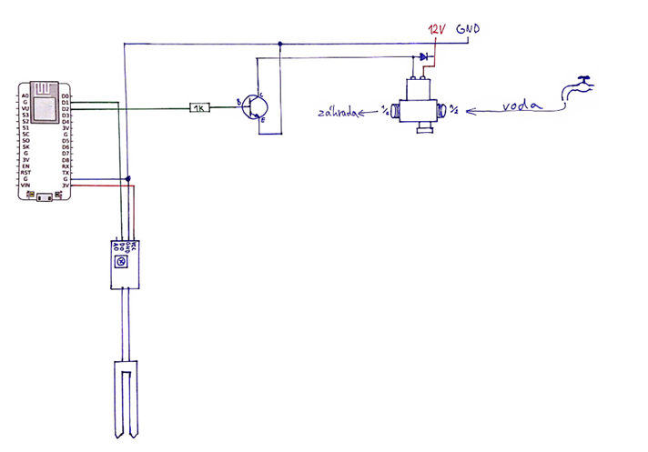
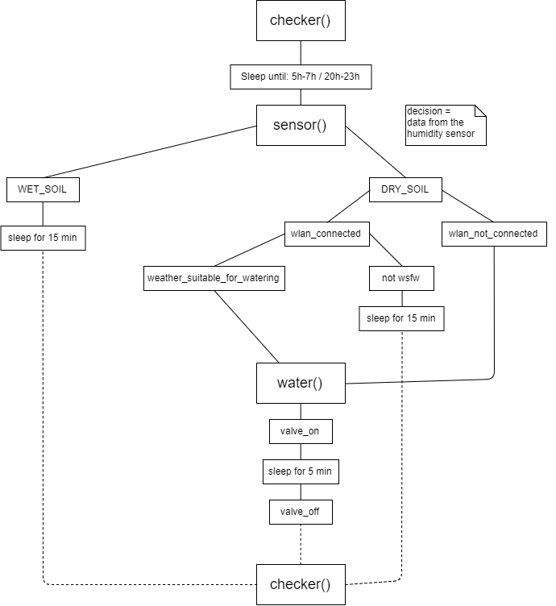

# Polievač záhrady
## Hardware

### Úvod

Tento projekt je modifikáciou zavlažovaču kvetináča. Merač vlhkosti sníma vlhkosť pôdy, ale namiesto vodnej pumpy je podľa potreby spínaný elektromagnetický ventil napojený na vodovod. Na rozdiel od kvetináču v byte, na záhradu aj prší a preto pracujeme s predpoveďou počasia. Ak je pôda suchá, ale v blízkej dobe bude pršať, program počká a ušetrí vodu.

### Postup

Vidlicu meraču vlhkosti pripojíme k jeho doske dvoma káblikmi. Keďže meria odpor (pôdy) nezáleží na tom, ktorý pin pripojíme kam. Na opačnej strane dosky sú štyri piny. VCC zapojíme na pin 3.3V na NodeMCU, GND na GND. Pin DO (digital out) zapojíme na pin D1 (Pin5 v micropythone). Pin AO nepoužijeme, keďže nepotrebujeme pracovať s presnou hodnotou vlhkosti pôdy, ale stačí nám vedieť len či je zem vlhká alebo suchá (digitálna 1 alebo 0).

Na pin D2 na NodeMCU pripojíme cez 1k ohm rezistor bázu(B) tranzistora TIP120. Jeho použitie je nutné, keďže elektromagnetický ventil pracuje na 12 voltov ale procesor na 3.3V. Na kolektor(C) pripojíme kábel ktorý neskôr pripojíme na elmag ventil. Emitor(E) tranzistoru pripojíme na zem 12V zdroja _a zároveň na zem NodeMCU (pin G)._ Toto je dôležité pre správnu funkčnosť. Keby sme emitor pripojili len na zem 12V zdroja, nikdy by sa neuzavrel obvod pin D1 -&gt; GND(nodeMCU). Žiaden prúd by cez bázu neprúdil, aj napriek tomu, že D1 by bol nastavený na HIGH.

Elektromagnetický ventil nemá označené piny a je jedno na ktorý príde 12V a ktorý pripojíme na kolektor tranzistoru. Tento ventil ale pracuje, ako už názov napovedá, na báze elektromagnetizmu. Inými slovami, vnútri je cievka ktorou keď tečie prúd, vytvára magnetické pole, ktoré hýbe uzáverom vody. V momente keď prúd cievkou prestane tiecť, uzáver sa pohne do pôvodnej polohy a tým na cievke indukuje napätie s opačnou polaritou. Toto by mohlo poškodiť elektronické komponenty nášho projektu, čomu treba zabrániť. Riešením je obyčajná dióda zapojená paralelne na zdroj tak, aby 12V zo zdroja cez ňu netieklo, ale opačné napätie indukované ventilom áno. Tu treba byť opatrný, keďže _zle zapojená dióda vyskratuje zdroj a nie nebezpečné opačné napätie._ Na tento účel postačuje aj napr. dióda 1N400X, keďže špičkový prúd zvláda až do 30A. Dióda by mala byť umiestnená čo najbližšie k ventilu, napríklad pripevnená v termináloch rovno s káblami.

Zostáva už len nahrať kód, pripojiť 12V zdroj podľa schémy, NodeMCU napájať cez USB z nabíjačky od mobilu _alebo_ na 12V zdroj pripojiť regulátor na 5V, ktorého výstup príde na pin VIN a zem na G. Potom stačí pichnúť vidlicu merača do zeme a malým šrobovákom nastaviť na doske merača potenciometer tak, aby sme určili hranicu medzi suchou a vlhkou pôdou. Taktiež treba overiť, či má NodeMCU v záhrade dostatočne silný signál WiFi. Na záver si treba overiť inštalatérske zručnosti a ventil zapojiť z jednej strany na vodovodnú sieť a z druhej na hadicu ktorou zavlažujeme. Ventil má 1/2&quot; závity, a smer toku vody určuje šípka na spodnej strane.

<https://www.ebay.com/itm/Soil-Hygrometer-Humidity-Detection-Module-Moisture-Water-Sensor-for-Arduino-MO-/152313534468?hash=item2376981804>

<https://www.ebay.com/itm/N-C-DC-12V-0-0-8MPa-1-2-Electric-Solenoid-Valve-for-Water-Air-Hot-/172599452473?hash=item282fbaa339>

## Software

Zdrojový kód si nahráme na dosku cez ľubovolné prostredie, treba sa uistiť, že sa nej nachádzajú všetky knižnice, ktoré sa v kóde používajú. Mali by byť v najnovšej Micropython štandarnej knižnici, ak nie tak ich treba nahrať ako samostatné .py súbory, všetky sa nachádzajú na GitHube Micropythonu. Pri štarte počítača sa automaticky pustí funkcia chceker a bude bežať pokiaľ bude počítač zapnutý.

### Funkcie

*checker()*
Jedinou úlohou funkcie je dostať počítač do časov vhodných na polievanie. Ak aktuálny čas nie je vhodný, tak si   dopočíta počet sekúnd do začiatku vhodného intervalu a dovtedy bude „spať&quot;.

*sensor()*
Zistí vlhkosť pody, ak je mokrá tak čaká a potom opakuje meranie. Ak je mokrá, tak skontroluje pripojenie na WiFi, ak je, tak zavolá *weather\_suitable\_for\_watering()*, ak je výstup True, tak spustí *water()*, ak False, tak počká a pri daľšom meraní možem byť predpoveď zmenená. Ak nemáme pripojenie na WiFi, počasie zanedbáme. Kebyže sa senzor pokazí a tvrdí, že je pôda stále mokrá, tak vďaka kontrole cez *days\_since\_watering* sa záhrada nepoleje raz za viac ako 4 dni.

*weather\_suitable\_for\_watering()*
Vráti boolean, či je počasie vhodné na polievanie. Cez Yahoo Weather API dostaneme kód počasia, a cez tabuľky na webstránke služby si vyberieme podmienky pri ktorých chceme polievať, u nás je to žiadny dážď.

*water()*
Na 5 minút otvorí uzáver vody a poleje záhradu, ak nebolo aspoň 4 dni poliata. Zároveň vynuluje počítadlo dní od posledného poliatia.

 
